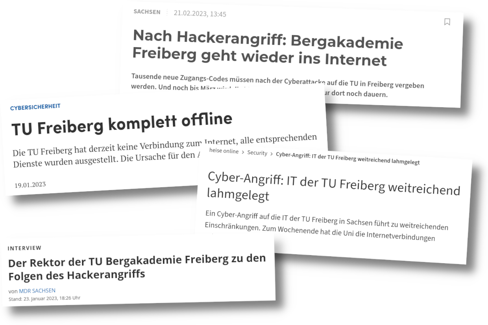
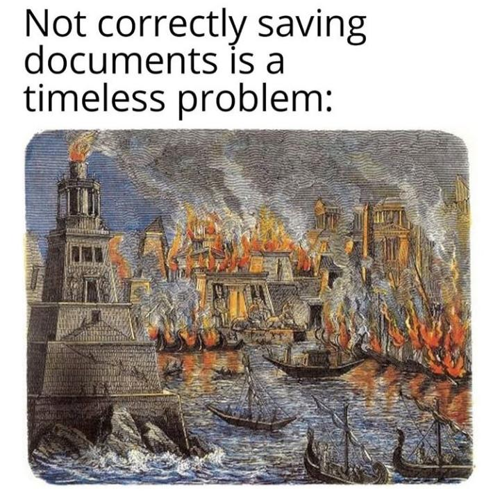
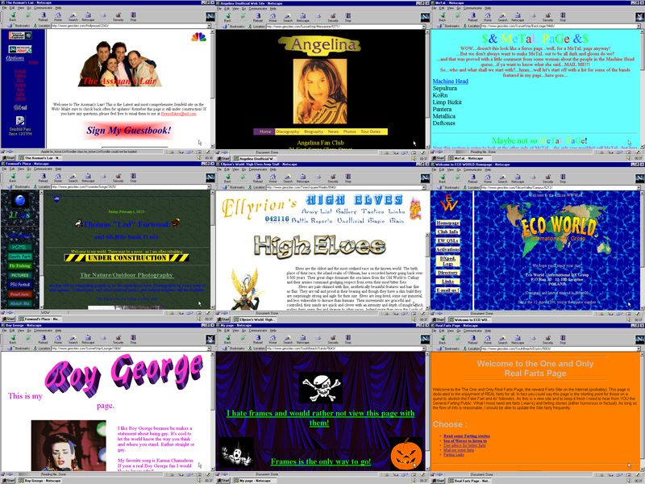
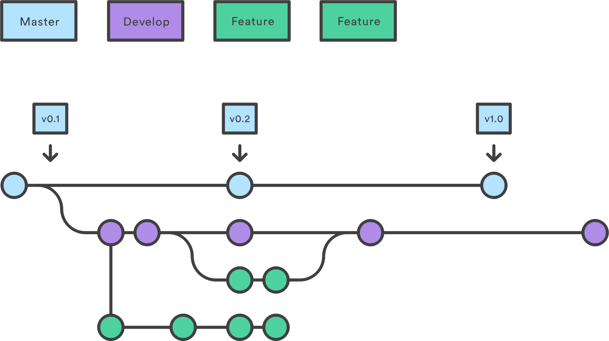
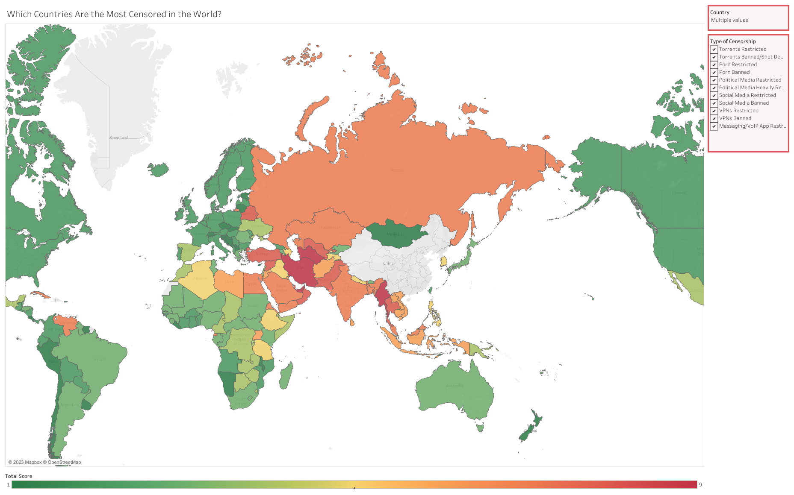
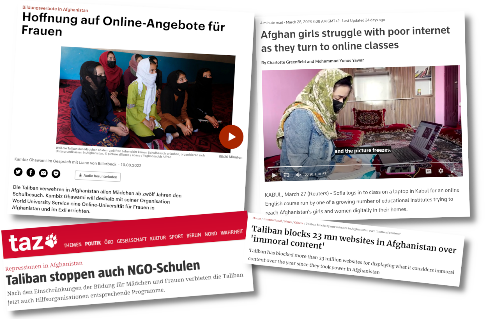

<!--
author:   André Dietrich & Sebastian Zug

email:    LiaScript@web.de

version:  0.0.1

language: de

narrator: Deutsch Female

comment:  Try to write a short comment about
          your course, multiline is also okay.


import:    https://raw.githubusercontent.com/liaTemplates/ABCjs/main/README.md
           https://raw.githubusercontent.com/liaTemplates/AVR8js/main/README.md
           https://raw.githubusercontent.com/liaTemplates/TextAnalysis/main/README.md


-->

# Wie kann Web 3.0 Lehre retten?


                      --{{0}}--
Anfang dieses Jahres wurde an der TU Bergakademie, wie an vielen anderen Hochschulen auch, die IT von einem Hack lahmgelegt.

                       {{0-1}}


                      --{{1}}--
_An der gesamten Hochschule?_
_Nein!_
Ein kleiner Teil von Wissenschaftlern am Instut für Informatik wehrt sich wehement und versucht Lehrmaterialen und Bildung offen, interaktiv, kollaborativ, nachhaltig, unabschaltbar und vor allem __kostenlos__ zur Verfügung zu stellen.
Im nun folgenden Vortrag möchten wir euch Wege und Technologien aufzeigen, die dafür heute schon genutzt werden können.


                       {{1-2}}
<iframe id="map" src="https://www.google.com/maps/embed?pb=!1m18!1m12!1m3!1d745.0172241379928!2d13.329770317829896!3d50.92568159562554!2m3!1f0!2f0!3f0!3m2!1i1024!2i768!4f13.1!3m3!1m2!1s0x47a7600bf919ad43%3A0x4dc2cb2137dcaed9!2sTechnische%20Uni%2FBergakademie%20Freibg.%20Geologisches%20Institut!5e1!3m2!1sde!2sde!4v1681986802498!5m2!1sde!2sde" style="width: 100%; height: 60vh; border:0;" allowfullscreen="" loading="lazy" referrerpolicy="no-referrer-when-downgrade"></iframe>

                      --{{2}}--
Wir sind Sebastian Zug (Professur für Softwaretechnologie und Robotik) und André Dietrich (Entwickler von LiaScript)?

                        {{2}}
| Name           | eMail                                   | Twitter                                            |
|----------------|-----------------------------------------|----------------------------------------------------|
| Sebastian Zug  | sebastian.zug@informatik.tu-freiberg.de | [\@ZugSebastian](https://twitter.com/ZugSebastian) |
| André Dietrich | LiaScript@web.de                        | [\@an_dietrich](https://twitter.com/an_dietrich)   |


## 0. Prolog: Was ist LiaScript?


                --{{0}}--
Ursprünglich haben wir mit der Entwicklung von LiaScript begonnen, damit wir selber für verschiedene Lehrinhalte online-Kurse erstellen konnten.
LiaScript basiert auf Markdown, einer einfachen Auszeichnungssprache für statische Inhalte, wie sie unten abgebildet ist.
Die Syntax ist sehr einfach gehalten und Markdown-Text kann mit jedem beliebigen Text-Editor verfasst werden.

``` markdown
# Titel

Ein **dicker** Absatz kommt
in zwei,
nein drei Zeilen.

## Untertitel

* Aufzählung mit

* Unterpunkten:

  1. Punkt
  2. Punkte  

### Unterunterabschnitt

| Mit     | einer  |
|---------|--------|
| Tabelle | und    |
| zwei    | Zeilen |
```
           --{{1}}--
Zu exotisch?
Verschickt mal diesen Text in WhatsApp und beobachtet, was passiert.


             {{1}}
```` markdown
_Versucht_ *das* ~nicht~ in WhatsApp!

```
code kann so aussehen
...
```
````

### LiaScript: Demo or Die

todo: URL

              --{{0}}--
Wir haben versucht das Textformat um Markdown herum zu erweitern, sodass es ebenso verständlich und einfach ist, jedoch heutigen Ansprüchen genügt.
Ein Vorteil für uns dabei ist, dass ein und der selbe Kurs in verschiedenen Formaten konsumiert werden kann.
Wenn ihr oben auf das Icon für den Präsentationsmodus klickt, dann könnt ihr wählen zwischen den Formaten _Lehrbuch_, _Präsentation_, und _Folien_.
Sprich, ein Textdokument kann entweder als Buch oder interaktive Präsentation zum Selbststudium genutzt werden oder wir nutzen nur den Folien-modus in unseren Vorträgen.
Und ja, die meisten Browser verfügen über Text-To-Speech engine, mit deren Hilfe man sich Kommentare, Dialoge vorlesen lassen kann.

             --{{1}}--
Zuerst erscheint der Absatz in einer Zeile nur.

    {{1}}
Ein **dicker** Absatz kommt
in zwei,
nein drei Zeilen.

             --{{2}}--
Gefolgt von der Aufzählung.

     {{2}}
* Aufzählung mit

* Unterpunkten:

  1. Punkt
  2. Punkte  


     {{3}}
| Animal          | weight in kg | Lifespan years | Mitogen |
| --------------- | ------------:| --------------:| -------:|
| Mouse           |        0.028 |             02 |      95 |
| Flying squirrel |        0.085 |             15 |      50 |
| Brown bat       |        0.020 |             30 |      10 |
| Sheep           |           90 |             12 |      95 |
| Human           |           68 |             70 |      10 |

           --{{3}}--
Tabellen werden intern analysiert ob sie gegebenfalls eine Möglichen Datensatz repräsentieren, der in verschiedenen Formaten und interaktiv visualisiert werden kann.

                  --{{4}}--
Falls möglich können auch externe Quellen eingebettet werden, zwei vorangestellte Fragezeichen vor einem Link sagen LiaScript es soll alles versuchen was möglich ist um den Inhalt im Dokument darzustellen.

     {{4}}
??[GeoGebra](https://www.geogebra.org/classic/mqsvh7vh)

                   --{{5}}--
Quizze sind auch selbst erklärend, hoffen wir.

                        {{5}}
*******************************************************************

Wie fandet ihr die Demo bis jetzt?

- [( )] Ganz okay ...
- [( )] Haut mich nicht vom Hocker
- [(X)] Sehr gut, aber wie geht es weiter?

*******************************************************************

### Programmierung & Erweiterungen


Uns ging es ursprünglich um die bessere und interaktive Programmierkurse.
Um benötigte Zusatzfunktionalität integrieren zu können haben wir ein Makro-System geschaffen, dass dazu genutzt werden kann die Funktionen eines Dokuments in ein anderes zu importieren.
Zu bemerken ist, alles was mit einem `@` beginnt ist meist ein interner LiaScript-Befehl.
Die Bibliotheken werden im Kopf eines Kurses geladen.
Am Beispiel der Code-Snippets können wir diese durch einfaches anhängen eines Makros interaktiv und kollaborativ machen.


Verfügbare Erweiterungen: https://github.com/topics/liascript-template


<div id="example">
<wokwi-led color="red"   pin="13" label="13"></wokwi-led>
<wokwi-led color="green" pin="12" label="12"></wokwi-led>
<wokwi-led color="blue"  pin="11" label="11"></wokwi-led>
<wokwi-led color="blue"  pin="10" label="10"></wokwi-led>
<span id="simulation-time"></span>
</div>

``` cpp
byte leds[] = {13, 12, 11, 10};
void setup() {
  Serial.begin(115200);
  for (byte i = 0; i < sizeof(leds); i++) {
    pinMode(leds[i], OUTPUT);
  }
}

int i = 0;
void loop() {
  Serial.print("LED: ");
  Serial.println(i);
  digitalWrite(leds[i], HIGH);
  delay(250);
  digitalWrite(leds[i], LOW);
  i = (i + 1) % sizeof(leds);
}
```
@AVR8js.sketch(example)

                   --{{1}}--
Aber Code-Scnipsel müssen nicht nur Programmieren genutzt werden.
Mithilfe der [ABC-Notation](todo) kann man damit komponieren.


                     {{1}}
``` abc
% channel: 0
X:353
T: GLUECK AUF DER STEIGER KOEMMT
N: E1512
O: Europa, Mitteleuropa, Deutschland
R: Staende -, Bergmanns - Lied
M: 4/4
L: 1/16
K: G
 | G8F4A4 | G8z8 |
B8A4c4 | B8z4
G2A2 | B4B4B4A2B2 | c4A3AA4
A2B2 | c4c4c4B2c2 | d4B3BB4
A4 | G8F8 | G4e4d4
c2A2 | B8A8 | G8z8
```
@ABCJS.eval

Das gleiche Prinzip kann auch im Sprachenunterricht eingesetzt werden, um neben der Rechtschreibung auch die Komplexität von Texten zu analysieren und diese gegebenenfalls für verschiedene Zielgruppen anzupassen.

                    {{3}}
```
Playing games has always been thought to be important to
the development of well-balanced and creative children;
however, what part, if any, they should play in the lives
of adults has never been researched that deeply. I believe
that playing games is every bit as important for adults
as for children. Not only is taking time out to play games
with our children and other adults valuable to building
interpersonal relationships but is also a wonderful way
to release built up tension.
```
@Textanalysis.FULL


### Natürlich Chat-GPT

??[EduWeaver AutoCourse](https://colab.research.google.com/github/aneesha/eduweaver/blob/main/EduWeaver_AutoCourse.ipynb)

https://github.com/aneesha/eduweaver

### Wo finde ich mehr Informationen?

* Projekt-Webseite: https://LiaScript.github.io
* Code: https://github.com/liascript
* YouTube: https://www.youtube.com/channel/UCyiTe2GkW_u05HSdvUblGYg
* Weitere Quellen:

  * Dokumentation: https://github.com/LiaScript/docs
  * Freie Bücher: https://github.com/LiaBooks
  * Templates: https://github.com/topics/liascript-template
  * Kurse & ...: https://github.com/topics/liascript-course
  * Blog: https://aizac.herokuapp.com

* Editor: https://code.visualstudio.com/Download
  
  * Liascript-Preview: https://marketplace.visualstudio.com/items?itemName=LiaScript.liascript-preview
  * Liascript-Snippets: https://marketplace.visualstudio.com/items?itemName=LiaScript.liascript-snippets

* Development-Server: https://www.npmjs.com/package/@liascript/devserver
* Exporter: https://www.npmjs.com/package/@liascript/exporter

---

Kontakt via:

* eMail: LiaScript@web.de
* Twitter: https://twitter.com/LiaScript
* Chat: https://gitter.im/LiaScript/community


## 1. Akt: Vom Problem des Speicherns

                      --{{0}}--
_Ich bin der Geist, der stets verneint! Und das mit Recht; denn alles, was entsteht, Ist wert, daß es zugrunde geht;_

                      --{{0}}--
Wie lange wird deine Platform existieren?
Jeder der bei diesem Meme lacht, sollte jetzt aufhorchen.
Die durchschnittliche Lebensspanne einer Webseite beträgt heutzutage laut
[Forbes](https://www.forbes.com/sites/forbesagencycouncil/2021/03/01/your-websites-life-span-may-be-shorter-than-you-think/)
2 Jahre und 7 Monate, laut [IPFS](https://ipfs.tech) 100 Tage.

                       {{0-1}}



                      --{{1}}--
_"Ich vertrau auf Google!", "YouTube gibt es schon über 20 Jahre.", "Alles im meiner Office 365 Cloud!"_
Keiner kann garantieren, dass solche Giganten und andere kleine Anbieter nicht irgendwann wieder ins Licht gehen.
Kennt noch jemand Yahoo?
Yahoo hatte 2009 den hosting-Dienst [GeoCities](https://en.wikipedia.org/wiki/Yahoo!_GeoCities) gelöscht, womit geschätze 38 Milionen nutzergenerierte Seiten verschwanden.

                       {{1-2}}


                      --{{2}}--
Aus einer Studie mit dem interessanten Namen _"Adresse nicht gefunden"_ geht hervor, dass von den bis 2009 in Deutschland geförderten E-Learning Projekten etwa die Hälfte nicht mehr zu erreichen ist.
Das traurige Fazit des Berichts lautet, wenn die Gelder und die Mitarbeiter gehen, dann gehen auch kurz darauf die Inhalte verloren, falls keine entsprechende Konzepte zur nachhaltigen Nutzung existieren.

                        {{2}}
")


### Lösung: Dezentrale Speicherung von Inhalten

Wie können Inhalte dezentral gespeichert werden?


#### Git

                      --{{0}}--
Git ist ein Versions-Verwaltungs-System das per-se schon dezentral und offline funktioniert.
Jedes Git-Projekt das sich auf lokal auf irgendeiner Festplatte befindet ist eine vollständige Kopie sämtlicher versionen eines Projektes.
Das Bild zeigt schematisch einen Versionsbaum mit verschiedenen Entwicklungssträngen auf denen parallel Code oder LiaScript-Kurse entwickelt werden können.
Jeder Punkt stellt einen Entwicklungsstand eine Version eines Projektes dar und jede Version kann auch wiederhergestellt werden.
Der Vorteil dabei ist, dass verschiedene Entwicklungstränge auch wieder zusammengeführt werden können, auch von anderen Projekten





                        {{1}}
<section>

#### Selber hosten?


                      --{{1}}--
[GitHub](https://github.com), [GitLab](https://gitlab.com) und [Gogs](https://gogs.io) sind Git-Plattformen, wobei die letzten beiden freie Open-Source-Server zum selber "hosten" zur Verfügung stellen.
Nur wenige wissen, das `git` seleber als Versions-Verwaltungs-System auch als WebServer genutzt werden kann.  


* GitLab: https://gitlab.com
* Gogs: https://gogs.io
* How to Setup a Git Server with only `git`: https://linuxize.com/post/how-to-setup-a-git-server/

</section>


#### RIP: Beaker Browser

Der Beaker-Browser war anders!
Leider wurde vor kurzem eingestellt.
Es handelte sich um einen Peer-2-Peer Browser, der es erlaubte im Browser direkt komplette WebSeiten zu erstellen oder auch LiaScript-Markdown Projekte.
Für jedes Projekt wurde eine eindeutige URL in Form einer großen Zufallszahl erstellt.
Anstatt über das `http` oder `https` Protokol auf die Inhalte zuzugreifen, konnten diese über das `hyper` Protokol aufgerufen werden.
War der Browser aus oder offline ist, konnte auf die Daten nicht mehr zugegriffen werden, aber jeder andere Beaker-Browser der auf die Inhalte zugegriffen hatte konnte diese auch selber wieder teilen.

!?[Beaker-Browser](https://www.youtube.com/watch?v=faBigIjf05M)

#### Inter-Planetary File System

Das Inter-Planetary File System oder IPFS ist ebenfalls ein Peer-2-Peer Netzwerk und kann als verteilte DropBox oder Datenbank gesehen werden.
Anstatt von Namen wird jeder Datei ein Hashwert zugeordnet, dabei handelt es sich praktisch um einen Fingerabdruck.
Wird die gleiche Datei von jemand anderem via IPFS geteilt, so erhält sie den gleichen Hashwert auch wenn der Name ein anderer ist.

#### Tor & OnionShare


                         {{1}}
<div style="width:100%;height:0;padding-bottom:80%;position:relative;"><iframe src="https://giphy.com/embed/3ogwFSxwLoc3eNSfyE" width="100%" height="100%" style="position:absolute" frameBorder="0" class="giphy-embed" allowFullScreen></iframe></div><p><a href="https://giphy.com/gifs/feistmusic-century-feist-3ogwFSxwLoc3eNSfyE">via GIPHY</a></p>

#### Internet & Bildung?

                       --{{1}}--
Warum sollte so etwas wie Tor in der Bildung überhaupt relevant sein?
Schaut man sich die Weltkarte an, dann wird schnell klar, dass das Internet nicht so frei und offen ist, wie es vielleicht von Deutschland aus wirkt.
In dieser Karte haben wir China und Nord-Korea bewusst herausgenommen um den anderen Ländern auch die Möglichkeit zu geben rot zu werden.

                        {{0-1}}


Um dies fortzuführen soll exemplarisch Afghanistan herausgenommen werden.
Ein Land in dem 

                         {{1}}



## 2. Akt: Offline?


## 3. Akt: Kommunikation ohne Server und Login

## asfd

