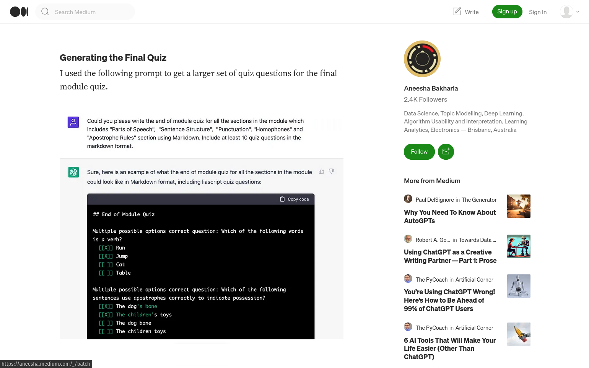
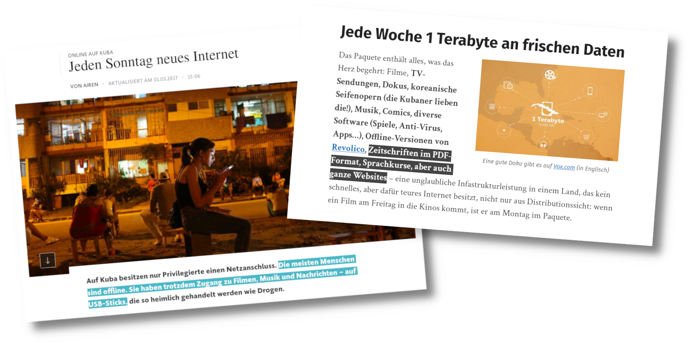
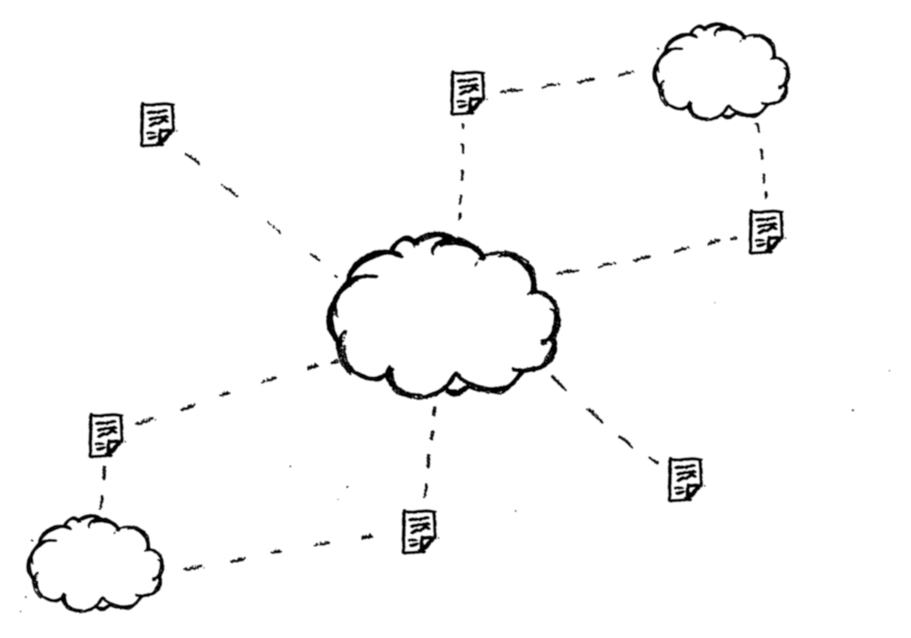
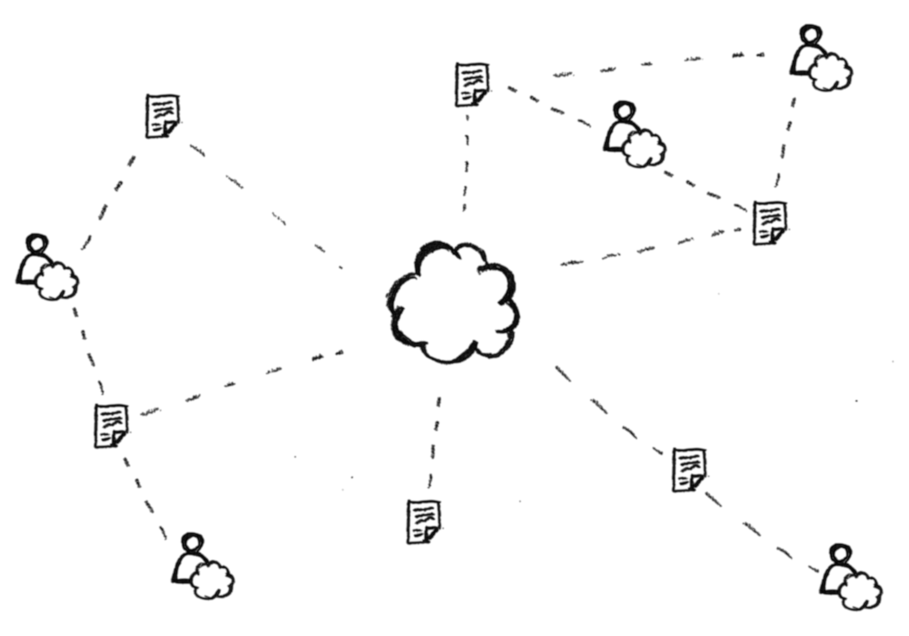

<!--
author:   André Dietrich & Sebastian Zug

email:    LiaScript@web.de

version:  0.0.1

language: de

narrator: Deutsch Female

comment:  Try to write a short comment about
          your course, multiline is also okay.


import:    https://raw.githubusercontent.com/liaTemplates/ABCjs/main/README.md
           https://raw.githubusercontent.com/liaTemplates/AVR8js/main/README.md
           https://raw.githubusercontent.com/liaTemplates/TextAnalysis/main/README.md

link:      https://cdnjs.cloudflare.com/ajax/libs/animate.css/4.1.1/animate.min.css
-->

# Wie kann Web 3.0 Lehre retten?


                      --{{0}}--
Anfang dieses Jahres wurde an der TU Bergakademie, wie an vielen anderen Hochschulen auch, die IT von einem Hack lahmgelegt.

                       {{0-1}}


                      --{{1}}--
_An der gesamten Hochschule?_
_Nein!_
Ein kleiner Teil von Wissenschaftlern am Instut für Informatik wehrt sich wehement und versucht Lehrmaterialen und Bildung offen, interaktiv, kollaborativ, nachhaltig, unabschaltbar und vor allem __kostenlos__ zur Verfügung zu stellen.
Im nun folgenden Vortrag möchten wir euch Wege und Technologien aufzeigen, die dafür heute schon genutzt werden können.


                       {{1-2}}
<iframe id="map" src="https://www.google.com/maps/embed?pb=!1m18!1m12!1m3!1d745.0172241379928!2d13.329770317829896!3d50.92568159562554!2m3!1f0!2f0!3f0!3m2!1i1024!2i768!4f13.1!3m3!1m2!1s0x47a7600bf919ad43%3A0x4dc2cb2137dcaed9!2sTechnische%20Uni%2FBergakademie%20Freibg.%20Geologisches%20Institut!5e1!3m2!1sde!2sde!4v1681986802498!5m2!1sde!2sde" style="width: 100%; height: 60vh; border:0;" allowfullscreen="" loading="lazy" referrerpolicy="no-referrer-when-downgrade"></iframe>

                      --{{2}}--
Wir sind Sebastian Zug (Professur für Softwaretechnologie und Robotik) und André Dietrich (Entwickler von LiaScript)?

                        {{2}}
| Name           | eMail                                   | Twitter                                            |
|----------------|-----------------------------------------|----------------------------------------------------|
| Sebastian Zug  | sebastian.zug@informatik.tu-freiberg.de | [\@ZugSebastian](https://twitter.com/ZugSebastian) |
| André Dietrich | LiaScript@web.de                        | [\@an_dietrich](https://twitter.com/an_dietrich)   |


## 0. Prolog: Was ist LiaScript?


                --{{0}}--
Ursprünglich haben wir mit der Entwicklung von LiaScript begonnen, damit wir selber für verschiedene Lehrinhalte online-Kurse erstellen konnten.
LiaScript basiert auf Markdown, einer einfachen Auszeichnungssprache für statische Inhalte, wie sie unten abgebildet ist.
Die Syntax ist sehr einfach gehalten und Markdown-Text kann mit jedem beliebigen Text-Editor verfasst werden.

``` markdown
# Titel

Ein **dicker** Absatz kommt
in zwei,
nein drei Zeilen.

## Untertitel

* Aufzählung mit

* Unterpunkten:

  1. Punkt
  2. Punkte  

### Unterunterabschnitt

| Mit     | einer  |
|---------|--------|
| Tabelle | und    |
| zwei    | Zeilen |
```
           --{{1}}--
Zu exotisch?
Verschickt mal diesen Text in WhatsApp und beobachtet, was passiert.


             {{1}}
```` markdown
_Versucht_ *das* ~nicht~ in WhatsApp!

```
code kann so aussehen
...
```
````

### LiaScript: Demo or Die

todo: URL

              --{{0}}--
Wir haben versucht das Textformat um Markdown herum zu erweitern, sodass es ebenso verständlich und einfach ist, jedoch heutigen Ansprüchen genügt.
Ein Vorteil für uns dabei ist, dass ein und der selbe Kurs in verschiedenen Formaten konsumiert werden kann.
Wenn ihr oben auf das Icon für den Präsentationsmodus klickt, dann könnt ihr wählen zwischen den Formaten _Lehrbuch_, _Präsentation_, und _Folien_.
Sprich, ein Textdokument kann entweder als Buch oder interaktive Präsentation zum Selbststudium genutzt werden oder wir nutzen nur den Folien-modus in unseren Vorträgen.
Und ja, die meisten Browser verfügen über Text-To-Speech engine, mit deren Hilfe man sich Kommentare, Dialoge vorlesen lassen kann.

             --{{1}}--
Zuerst erscheint der Absatz in einer Zeile nur.

    {{1}}
Ein **dicker** Absatz kommt
in zwei,
nein drei Zeilen.

             --{{2}}--
Gefolgt von der Aufzählung.

     {{2}}
* Aufzählung mit

* Unterpunkten:

  1. Punkt
  2. Punkte  


     {{3}}
| Animal          | weight in kg | Lifespan years | Mitogen |
| --------------- | ------------:| --------------:| -------:|
| Mouse           |        0.028 |             02 |      95 |
| Flying squirrel |        0.085 |             15 |      50 |
| Brown bat       |        0.020 |             30 |      10 |
| Sheep           |           90 |             12 |      95 |
| Human           |           68 |             70 |      10 |

           --{{3}}--
Tabellen werden intern analysiert ob sie gegebenfalls eine Möglichen Datensatz repräsentieren, der in verschiedenen Formaten und interaktiv visualisiert werden kann.

                  --{{4}}--
Falls möglich können auch externe Quellen eingebettet werden, zwei vorangestellte Fragezeichen vor einem Link sagen LiaScript es soll alles versuchen was möglich ist um den Inhalt im Dokument darzustellen.

     {{4}}
??[GeoGebra](https://www.geogebra.org/classic/mqsvh7vh)

                   --{{5}}--
Quizze sind auch selbst erklärend, hoffen wir.

                        {{5}}
*******************************************************************

Wie fandet ihr die Demo bis jetzt?

- [( )] Ganz okay ...
- [( )] Haut mich nicht vom Hocker
- [(X)] Sehr gut, aber wie geht es weiter?

*******************************************************************

### Programmierung & Erweiterungen


Uns ging es ursprünglich um die bessere und interaktive Programmierkurse.
Um benötigte Zusatzfunktionalität integrieren zu können haben wir ein Makro-System geschaffen, dass dazu genutzt werden kann die Funktionen eines Dokuments in ein anderes zu importieren.
Zu bemerken ist, alles was mit einem `@` beginnt ist meist ein interner LiaScript-Befehl.
Die Bibliotheken werden im Kopf eines Kurses geladen.
Am Beispiel der Code-Snippets können wir diese durch einfaches anhängen eines Makros interaktiv und kollaborativ machen.


Verfügbare Erweiterungen: https://github.com/topics/liascript-template


<div id="example">
<wokwi-led color="red"   pin="13" label="13"></wokwi-led>
<wokwi-led color="green" pin="12" label="12"></wokwi-led>
<wokwi-led color="blue"  pin="11" label="11"></wokwi-led>
<wokwi-led color="blue"  pin="10" label="10"></wokwi-led>
<span id="simulation-time"></span>
</div>

``` cpp
byte leds[] = {13, 12, 11, 10};
void setup() {
  Serial.begin(115200);
  for (byte i = 0; i < sizeof(leds); i++) {
    pinMode(leds[i], OUTPUT);
  }
}

int i = 0;
void loop() {
  Serial.print("LED: ");
  Serial.println(i);
  digitalWrite(leds[i], HIGH);
  delay(250);
  digitalWrite(leds[i], LOW);
  i = (i + 1) % sizeof(leds);
}
```
@AVR8js.sketch(example)

                   --{{1}}--
Aber Code-Scnipsel müssen nicht nur Programmieren genutzt werden.
Mithilfe der [ABC-Notation](todo) kann man damit komponieren.


                     {{1}}
``` abc
% channel: 0
X:353
T: GLUECK AUF DER STEIGER KOEMMT
N: E1512
O: Europa, Mitteleuropa, Deutschland
R: Staende -, Bergmanns - Lied
M: 4/4
L: 1/16
K: G
 | G8F4A4 | G8z8 |
B8A4c4 | B8z4
G2A2 | B4B4B4A2B2 | c4A3AA4
A2B2 | c4c4c4B2c2 | d4B3BB4
A4 | G8F8 | G4e4d4
c2A2 | B8A8 | G8z8
```
@ABCJS.eval

Das gleiche Prinzip kann auch im Sprachenunterricht eingesetzt werden, um neben der Rechtschreibung auch die Komplexität von Texten zu analysieren und diese gegebenenfalls für verschiedene Zielgruppen anzupassen.

                    {{3}}
```
Playing games has always been thought to be important to
the development of well-balanced and creative children;
however, what part, if any, they should play in the lives
of adults has never been researched that deeply. I believe
that playing games is every bit as important for adults
as for children. Not only is taking time out to play games
with our children and other adults valuable to building
interpersonal relationships but is also a wonderful way
to release built up tension.
```
@Textanalysis.FULL


### Natürlich ChatGPT

Bei LiaScript handelt es sich um reine Textbeschreibungen von Lehrinhalten.
ChatGPT ist eine Künstliche Intelligenz die Texte erzeugt.
Kann ChatGPT auch genutzt werden Online-Kurse für verschiedenste Themen auch in LiaScript zu erzeugen?
Die Antwort ist Ja.
[Dr Aneesha Bakharia](https://github.com/aneesha) Hauptverantwortliche für die Entwicklung und Umsetzung von Lernanalytik Initiativen an der University of Queensland (Australien), hat uns damit überrascht wie man ChatGPT LiaScript-Syntax beibringen kann.
Eine Anfrage zu einem bestimmten Lehrinhalt liefert als Result somit nicht nur einen Erklärtext, sondern gleich einen interaktiven LiaScript-Kurs mit Quizzen.



In einer 


??[EduWeaver AutoCourse](https://colab.research.google.com/github/aneesha/eduweaver/blob/main/EduWeaver_AutoCourse.ipynb)

https://github.com/aneesha/eduweaver


### Wo finde ich mehr Informationen?

* Projekt-Webseite: https://LiaScript.github.io
* Code: https://github.com/liascript
* YouTube: https://www.youtube.com/channel/UCyiTe2GkW_u05HSdvUblGYg
* Weitere Quellen:

  * Dokumentation: https://github.com/LiaScript/docs
  * Freie Bücher: https://github.com/LiaBooks
  * Templates: https://github.com/topics/liascript-template
  * Kurse & ...: https://github.com/topics/liascript-course
  * Blog: https://aizac.herokuapp.com

* Editor: https://code.visualstudio.com/Download
  
  * Liascript-Preview: https://marketplace.visualstudio.com/items?itemName=LiaScript.liascript-preview
  * Liascript-Snippets: https://marketplace.visualstudio.com/items?itemName=LiaScript.liascript-snippets

* Development-Server: https://www.npmjs.com/package/@liascript/devserver
* Exporter: https://www.npmjs.com/package/@liascript/exporter

---

Kontakt via:

* eMail: LiaScript@web.de
* Twitter: https://twitter.com/LiaScript
* Chat: https://gitter.im/LiaScript/community


## 1. Akt: Vom Problem des Speicherns

                      --{{0}}--
Wie lange wird deine Platform existieren?
Jeder der bei diesem Meme lacht, sollte jetzt aufhorchen.
Die durchschnittliche Lebensspanne einer Webseite beträgt heutzutage laut
[Forbes](https://www.forbes.com/sites/forbesagencycouncil/2021/03/01/your-websites-life-span-may-be-shorter-than-you-think/)
2 Jahre und 7 Monate, laut [IPFS](https://ipfs.tech) 100 Tage.

                       {{0-1}}


                      --{{1}}--
_"Ich vertrau auf Google!", "YouTube gibt es schon über 20 Jahre.", "Alles im meiner Office 365 Cloud!"_
Keiner kann garantieren, dass solche Giganten und andere kleine Anbieter nicht irgendwann wieder ins Licht gehen.
Kennt noch jemand Yahoo?
Yahoo hatte 2009 den hosting-Dienst [GeoCities](https://en.wikipedia.org/wiki/Yahoo!_GeoCities) gelöscht, womit geschätze 38 Milionen nutzergenerierte Seiten verschwanden.

                       {{1-2}}


                      --{{2}}--
Aus einer Studie mit dem interessanten Namen _"Adresse nicht gefunden"_ geht hervor, dass von den bis 2009 in Deutschland geförderten E-Learning Projekten etwa die Hälfte nicht mehr zu erreichen ist.
Das traurige Fazit des Berichts lautet, wenn die Gelder und die Mitarbeiter gehen, dann gehen auch kurz darauf die Inhalte verloren, falls keine entsprechende Konzepte zur nachhaltigen Nutzung existieren.

                        {{2}}
")


### Lösung: Dezentrale & replizierte Speicherung


                      --{{0}}--
Wenn __eine__ Zelle stirbt, dann mit ihr gehen alle ihre Informationen verloren.
Kopiert man die Inhalte und speichert sie an unterschiedlichen Orten, dann bleiben die Informationen mit einer höheren Wahrscheinlichkeit erhalten.

                       {{0-1}}
<div style="width:100%;height:0;padding-bottom:80%;position:relative;"><iframe src="https://giphy.com/embed/3ogwFSxwLoc3eNSfyE" width="100%" height="100%" style="position:absolute" frameBorder="0" class="giphy-embed" allowFullScreen></iframe></div><p><a href="https://giphy.com/gifs/feistmusic-century-feist-3ogwFSxwLoc3eNSfyE">via GIPHY</a></p>


    {{1-3}}
<section>

#### Git

                      --{{1}}--
Git ist ein Versions-Verwaltungs-System das per-se schon dezentral und offline funktioniert.
Jedes Git-Projekt das sich auf lokal auf irgendeiner Festplatte befindet ist eine vollständige Kopie sämtlicher versionen eines Projektes.
Das Bild zeigt schematisch einen Versionsbaum mit verschiedenen Entwicklungssträngen auf denen parallel Code oder LiaScript-Kurse entwickelt werden können.
Jeder Punkt stellt einen Entwicklungsstand eine Version eines Projektes dar und jede Version kann auch wiederhergestellt werden.
Der Vorteil dabei ist, dass verschiedene Entwicklungstränge auch wieder zusammengeführt werden können, auch von anderen Projekten


                        {{2}}
<div>

#### Selber hosten?

                      --{{2}}--
[GitHub](https://github.com), [GitLab](https://gitlab.com) und [Gogs](https://gogs.io) sind Git-Plattformen, wobei die letzten beiden freie Open-Source-Server zum selber "hosten" zur Verfügung stellen.
Nur wenige wissen, das `git` seleber als Versions-Verwaltungs-System auch als WebServer genutzt werden kann.  

* GitLab: https://gitlab.com
* Gogs: https://gogs.io
* How to Setup a Git Server with only `git`: https://linuxize.com/post/how-to-setup-a-git-server/

</div>

</section>

     {{3-5}}
<section>

#### Inter-Planetary File System

                      --{{3}}--
Das Inter-Planetary File System oder IPFS ist ebenfalls ein Peer-2-Peer Netzwerk und kann als verteilte DropBox oder Datenbank gesehen werden.
Anstatt von Namen wird jeder Datei ein Hashwert zugeordnet, dabei handelt es sich praktisch um einen Fingerabdruck.
Wird die gleiche Datei von jemand anderem via IPFS geteilt, so erhält sie den gleichen Hashwert auch wenn der Name ein anderer ist.


``` ascii

   (Client-Server Architektur)           (Peer-to-Peer (IPFS))
 ┌────────────────────────────┐     ┌────────────────────────────
▒│ 📱 -----.        .----- 💻 │    ▒│     📱---------💻 ┄ ┄ ┄ ┄
▒│          \      /          │    ▒│    / \          \
▒│           \    /           │    ▒│   /   \          \
▒│  💻 ------- 🖥 ------- 📱  │    ▒│ 💻-----💻---------📱 ┄ ┄
▒│           /    \           │    ▒│   \   /  \       /
▒│          /      \          │    ▒│    \ /    \            📱
▒│ 📱 -----'        '----- 💻 │    ▒│     📱-----💻 ┄ ┄ ┄ ┄
▒└────────────────────────────┘    ▒└────────────────────────────
▒▒▒▒▒▒▒▒▒▒▒▒▒▒▒▒▒▒▒▒▒▒▒▒▒▒▒▒▒▒     ▒▒▒▒▒▒▒▒▒▒▒▒▒▒▒▒▒▒▒▒▒▒▒▒▒▒▒▒▒
```

                      --{{4}}--
Die Vorteile sind offensichtlich, falls ein Peer ausfällt, können die Daten dennoch bezogen werden, auch bei sehr fragilen Internetverbindungen mit Verbindungsabbrüchen.
Und dass das Projekt langsam aber sicher im Mainstream ankommt, sieht man dadurch, dass der [Brave Browser](todo) und [Opera](todo) neben `http` und `https` jetzt auch `ipfs` und `ipns` als Protokol unterstützen und es ebenfalls erlauben Inhalte direkt über den Browser zu teilen.
Auch LiaScript-Kurse können über IPFS übertragen werden.

</section>

    {{5-6}}
<section>

#### Beaker Browser 🕊️

                      --{{5}}--
Der Beaker-Browser war anders!
Leider wurde vor kurzem eingestellt.
Es handelte sich um einen Peer-2-Peer Browser, der es erlaubte im Browser direkt komplette WebSeiten zu erstellen oder auch LiaScript-Markdown Projekte.
Für jedes Projekt wurde eine eindeutige URL in Form einer großen Zufallszahl erstellt.
Anstatt über das `http` oder `https` Protokol auf die Inhalte zuzugreifen, konnten diese über das `hyper` Protokol aufgerufen werden.
War der Browser aus oder offline ist, konnte auf die Daten nicht mehr zugegriffen werden, aber jeder andere Beaker-Browser der auf die Inhalte zugegriffen hatte konnte diese auch selber wieder teilen.

!?[Beaker-Browser](https://www.youtube.com/watch?v=faBigIjf05M)

</section>

    {{6}}
<section>

#### HowTo: Tor & OnionShare

                      --{{6}}--
Das [Tor-Netzwerk](https://de.wikipedia.org/wiki/Tor_%28Netzwerk%29) ist ein System, das es Benutzern ermöglicht, ihre Online-Aktivitäten und ihre Identität zu anonymisieren, indem es den Datenverkehr über mehrere Server leitet, um die Quelle der Daten zu verbergen.
Das Netzwerk besteht aus Tausenden von freiwilligen Servern auf der ganzen Welt, die als "Knotenpunkte" fungieren und den Datenverkehr verschlüsseln, um die Privatsphäre der Benutzer zu schützen.

__Tor Browser: For anonymous browsing__

* Download & Install: https://www.torproject.org/download/

* Disable private browsing to enable IndexedDB for caching LiaScript courses:
  
  Settings >> Privacy & Security >> History >> Always use private browsing mode (disable)

* Enable CORS:

  Settings >> Extensions & Themes >> Search for "[CORS Unblock](https://addons.mozilla.org/en-US/firefox/addon/cors-unblock/?utm_source=addons.mozilla.org&utm_medium=referral&utm_content=search)" >> Click on "[CORS Unblock](https://addons.mozilla.org/en-US/firefox/addon/cors-unblock/?utm_source=addons.mozilla.org&utm_medium=referral&utm_content=search)" >> Install (Add to Firefox)

  If you have __disabled private browsing__ mode, enable "CORS Unblock".

  Otherwise, enable the plugin first to be used in private mode:
  Settings >> Extensions & Themes >> "CORS Unblock" >> Run in Private Windows (Allow)


  


__OnionShare for anonymous hosting and sharing__

* Download & Install: https://onionshare.org
* Open and "Connect to Tor"
* Share data: Start Hosting >> Add Files or Add Folder >> Start sharing
* Send the Onion-Address and the Private-Key to your students
* Open the Onion-Address within the Tor-Browser, enter the private key and select "Remember this key"
* Open the README.md of the course and copy this URL
* Goto https://LiaScript.github.io and paste this URL "click on Load URL"

</section>

### Bildung, Internet & Barrieren?

                       --{{0}}--
Warum sollte so etwas wie Tor in der Bildung überhaupt relevant sein?
Schaut man sich die Weltkarte an, dann wird schnell klar, dass das Internet nicht so frei und offen ist, wie es vielleicht von Deutschland aus wirkt.
In dieser Karte haben wir China und Nord-Korea bewusst herausgenommen um den anderen Ländern auch die Möglichkeit zu geben rot zu werden.

                        {{0-1}}


                       --{{1}}--
Schaut man sich die derzeitige Situation in Afghanistan an, so wird deutlich, dass Recht auf Bildung vielerorts einfach nicht gegeben ist.
China unterstützt Afghanistan zwar beim Ausbau des 4G-Netzes, der Großteil der Bevölkerung hat noch immer kein Internet, jedoch wird gleicher Weise wird auch die Überwachung und Filterung verstärkt.

                         {{1}}


## 2. Akt: Offline First?

                       --{{0}}--
Nur ca. 50% der Weltbevölkerung hat überhaupt Zugriff auf das Internet.
Des Weiteren bilden Bandbreite, Netzwerkabbrüche und fehlende Technik ein weitere Hürde.

                        {{0-1}}


                       --{{1}}--
Kann es Internet auch offline geben?
Die Antwort ist Ja!
In Cuba gibt es zum Beispiel das [El Paquete Semanal](https://en.wikipedia.org/wiki/El_Paquete_Semanal).
Dabei wird wöchentlich ein Datenpaket der neusten Filme, Serien, Zeitungen, Programme zusammengestellt und verteilt.
LiaScript-Inhalte können so ohne Probleme transportiert werden.
Bildungsplattformen, bei denen jeder Klick, jedes Testergebnis durch einen Server geprüft werden muss, sind so kaum zu etablieren.

                        {{1-2}}


                       --{{2}}--
Dies bringt uns zur nächsten Frage.
__Können Webseiten auch offline funktionieren?__

                         {{2}}
<iframe src="https://giphy.com/embed/qkLqpGZhf1ACB8WbTl" width="480" height="451" frameBorder="0" class="giphy-embed" allowFullScreen></iframe><p><a href="https://giphy.com/gifs/happy-computer-app-qkLqpGZhf1ACB8WbTl">via GIPHY</a></p>

### Lösung: Progressive Web Apps

                 --{{0}}--
Eine Progressive Web App (PWA), die Offline-First-Designprinzipien verwendet, ist so gestaltet, dass sie auch ohne Internetverbindung funktioniert.
Durch das Caching von Dateien wie CSS und JavaScript auf dem Gerät des Benutzers kann die PWA schnell geladen werden, auch wenn keine Internetverbindung besteht.
Mithilfe von IndexedDB, einer in-Browser-Datenbank, können Daten und Inhalte offline gespeichert und später synchronisiert werden, wenn eine Internetverbindung verfügbar ist.
Dies ermöglicht eine nahtlose Benutzererfahrung, auch wenn die Internetverbindung instabil ist.

__PWA Vorteile:__

- Funktionieren offline
- Inhalte können nachgeladen und gecached werden
- Kann wie eine native App auf Android und anderen Systemen installiert werden
- Mit IndexedDB verfügt jeder Browser über eine leistungsstarke Datenbank
- {{1}} Nicht nur PWA:
  Zugriff auf [GeoLocation](https://developer.mozilla.org/en-US/docs/Web/API/Geolocation_API),
  [Kamera](https://developer.mozilla.org/en-US/docs/Web/API/MediaDevices/getUserMedia) und
  [Virtual Reality](https://developer.mozilla.org/en-US/docs/Web/API/WebVR_API),
  [Sensorik](https://developer.mozilla.org/en-US/docs/Web/API/Sensor_APIs)
  und [Bluetooth](https://developer.mozilla.org/en-US/docs/Web/API/Web_Bluetooth_API)
  sowie Browser zu Browser Kommunikation via [WebRTC](https://de.wikipedia.org/wiki/WebRTC)

                 --{{1}}--
Ein Browser ist nicht mehr nur ein Werkzeug Anzeigen von HTML-Seiten.
Browser verfügen heutezutage über eine Vielzahl von Betriebssystem-Funktionalitäten und ermöglichen sogar den Zugriff auf Hardware.

                 --{{2}}--
__Auch die LiaScript-Webseite ist eine PWA.__


## 3. Akt: Kommunikation zwischen Browsern


### Lösung: Classroom-Lite

Wir bilden den Zustand

[GunDB](https://gun.eco)

[Matrix]()

[CRDT]


## Zusammenfassung

                     --{{0}}--
Gehen wir von unserer Ursprungssituation aus, in der ein "Moodle" Server alle Lehrinhalte, Nutzerdaten, Versionen, etc. speichert und den gesamten Zugriff und die Kommunikation zwischen den Nutzern koordiniert.
Dieser Server kann vom Netz gehen oder gehackt werden, der Zugriff darauf kann geblockt werden und Datenpannen können immer passieren.

                      {{0-1}}
<!-- class="animate__animated animate__zoomIn" -->

                     --{{1}}--
Mit LiaScript haben wir zuerst versucht, die Lehrinhalte aus dem LMS herauszunehmen.
Des Weiteren ist es so möglich Inhalte in verschiedenen Systemen zu nutzen und sie können parallel oder kooperativ von mehreren Autoren gleichzeit bearbeitet, weiterentwickelt, übersetzt werden.
Ein weiterer Vorteil liegt in der redundaten Speicherung und verschiedenen Verteilungsmöglichkeiten (Web, App, IPFS, Tor, Moodle, etc.) von Lehrinhalten.

                      {{1-2}}
<!-- class="animate__animated animate__zoomIn" -->

                     --{{2}}--
Im zweiten Schritt wurden typische Platform-aktivitäten herausgenommen.
Das heißt, Lernende können auch offline Lehrinhalte konsumieren, Kurse werden lokal im Browser gecached, Zustandsinformationen zu Quizze, Umfragen, Programmieraufgaben, werden innerhalb des Browsers gespeichert und überprüft.

                      {{2-3}}
<!-- class="animate__animated animate__zoomIn" -->

                     --{{3}}--
Um Klassenräume und somit Kollaboration und Informationsaustausch zwischen verschiedenen Nutzern zu ermöglichen, wird ebenfalls kein zentraler Server mehr benötigt.
Dieser Dienst kann von mehreren Servern oder Plattformen übernommen werden.
Einerseits kann die ganze Kommunikation darüber realisiert werden, andererseits werden diese nur als Einstiegspunkt genutzt und dient nur der Kontaktaufnahme (finden von Peers).
Danach können die Browser der Nutzer auch direkt und in Echtzeit mittels WebRTC kommunizieren; ohne einen Server der für die Synchronisation der Informationen zuständig ist, hierfür können CRDTs genutzt werden.

                       {{3}}
<!-- class="animate__animated animate__zoomIn" -->

## Fazit

                      --{{0}}--
Wir können uns ewig im Kreis drehen ... Die Platform ist tod, es lebe die Platform ... oder wir nutzen die Chancen und Möglichkeit die uns ein dezentrales Netz und damit dezentrale Technologien geben, um Lehre und Bildung in einer digitalen Welt nachhaltig und unblockierbar auch in die entlegentsten Ecken des Planeten zu transportieren. 

                            {{|>}}
> ... Ich bin der Geist, der stets verneint!
> Und das mit Recht; denn alles, was __ZENTRAL__ entsteht, Ist wert, daß es zugrunde geht; ...
>
> -- Mephisto